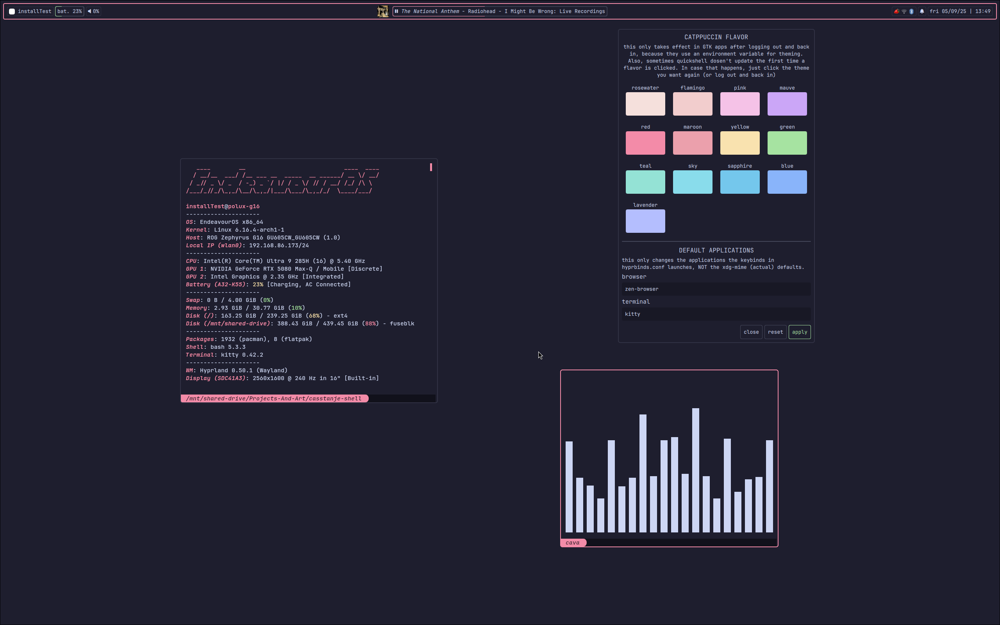
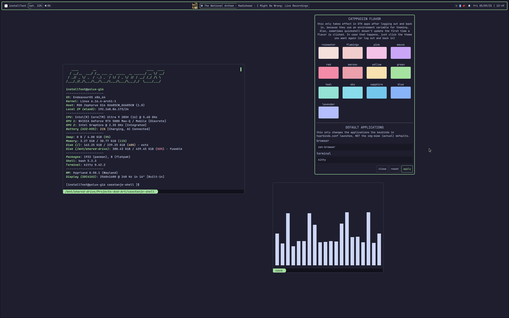
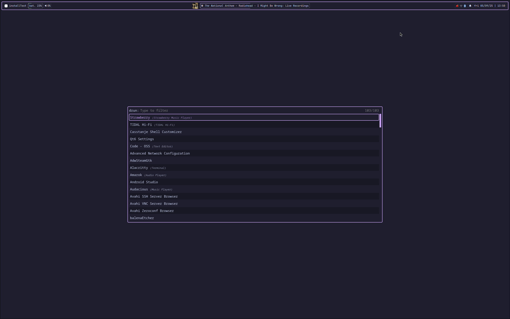

# Casstanje's Catppuccin Mocha Hyprland Shell for Arch Linux

## Gallery
 |  |
:-------------------------------------------------------: | :-----------------------------------------------------------:


---
A flat, simple rice for hyprland based on catppuccin mocha.

Technically compatible with all distros, but based on a lot of packages in the AUR and the arch repo, so it's gonna take some work setting up on non-arch based distros.


Most of the individual app configs and the qt / gtk themes are based on existing [catppuccin](https://catppuccin.com) ones.
Specifically:
- [GTK](https://github.com/catppuccin/gtk)
- [Kvantum](https://github.com/catppuccin/Kvantum) (QT)
- [Rofi](https://github.com/catppuccin/rofi)
- [Kitty](https://github.com/catppuccin/kitty)
## Features
### Customization GUI (Casstanje Shell Customizer)
A simple quickshell GUI that allows you to change the catppuccin flavor and bar layout, as well as the apps you want the keybinds to open

### Custom bar written in quickshell
A customizable status bar with a start menu, battery indicator, volume control, media bar (panel??), system tray, notification server and a clock. All modules can be switched on and off, and some have specific settings that you can fiddle with.

### Hyprland keybind cheatsheet in rofi
SUPER + A, by default

Script from [here](https://github.com/jason9075/rofi-hyprland-keybinds-cheatsheet) (thanks)

### No fluff
Doesn't install anything you might not want in your operating system by default. No chatbots, no extra propreitary apps, just the window manager, the bar, and the basics.

## Installation
1. Clone the repo and cd into it

```
git clone https://github.com/casstanje/casstanje-shell casstanje-shell-repo
cd casstanje-shell-repo
```

2. Run installer.sh (look at the script first, to ensure that everything is as you want it)
```
bash installer.sh
```

3. ... follow the instructions and reboot. Done!


## Dependencies
The installation scripts takes care of these, but if you wanna install the config manually, you must install them yourself.
- breeze [qt](https://archlinux.org/packages/extra/x86_64/breeze/) and [gtk](https://archlinux.org/packages/extra/any/breeze-gtk/)
- [jq](https://archlinux.org/packages/extra/x86_64/jq/)
- [pipewire](https://archlinux.org/packages/extra/x86_64/pipewire/) and [lib32-pipewire](https://archlinux.org/packages/multilib/x86_64/lib32-pipewire/)
- [pavucontrol-qt](https://archlinux.org/packages/extra/x86_64/pavucontrol-qt/)
- [imagemagick](https://archlinux.org/packages/?name=imagemagick)
- [qt6ct](https://archlinux.org/packages/extra/x86_64/qt6ct/)
- [fastfetch](https://archlinux.org/packages/extra/x86_64/fastfetch/)
- [kvantum](https://archlinux.org/packages/extra/x86_64/kvantum/)
    - [kvantum-theme-catppuccin-git](https://aur.archlinux.org/packages/kvantum-theme-catppuccin-git)
- [hyprland](https://wiki.hypr.land/Getting-Started/Installation/)
    - [hyprpaper](https://wiki.hypr.land/Hypr-Ecosystem/hyprpaper)
    - [hyprpicker](https://wiki.hypr.land/Hypr-Ecosystem/hyprpicker)
    - [xdg-desktop-portal-hyprland](https://wiki.hypr.land/Hypr-Ecosystem/xdg-desktop-portal-hyprland)
    - [hyprpolkitagent](https://wiki.hypr.land/Hypr-Ecosystem/hyprpolkitagent)
    - [hyprland-qt-support](https://wiki.hypr.land/Hypr-Ecosystem/hyprland-qt-support)
    - [hyprcursor](https://wiki.hypr.land/Hypr-Ecosystem/hyprcursor)
    - [hyprland-qtutils](https://wiki.hypr.land/Hypr-Ecosystem/hyprland-qtutils)
- [nwg-displays](https://archlinux.org/packages/extra/any/nwg-displays/)
- [quickshell](https://quickshell.org/docs/master/guide/install-setup/)
- [bluez](https://archlinux.org/packages/?name=bluez)
- [bluez-utils](https://archlinux.org/packages/?name=bluez-utils)
- [blueman](https://archlinux.org/packages/?name=blueman)
- [networkmanager](https://archlinux.org/packages/?name=networkmanager)
- [nm-connection-editor](https://archlinux.org/packages/?name=nm-connection-editor)
- [network-manager-applet](https://archlinux.org/packages/?name=network-manager-applet)
- [rofi-wayland](https://archlinux.org/packages/?name=rofi-wayland)
- others (one of each) 
    - browser (default: [zen-browser](https://github.com/zen-browser/desktop))
    - terminal (default: [kitty](https://github.com/kovidgoyal/kitty))
    - file manager (default: [nemo](https://archlinux.org/packages/extra/x86_64/nemo/))
    - editor (default: [code](https://archlinux.org/packages/extra/x86_64/code/))
    - if yours are different, you must change the defaults in ```$HOME/.config/casstanje-shell/config.json``` (or through the shell customization GUI) and log out and back in again. Also remember to change the xdg-mime defaults.
- [catppuccin-gtk-theme-mocha](https://aur.archlinux.org/packages/catppuccin-gtk-theme-mocha)
- [papirus icon theme](https://archlinux.org/packages/extra/any/papirus-icon-theme/)
- [catppuccin papirus folder colors](https://github.com/catppuccin/papirus-folders)
- fonts
    - [jetbrains mono](https://archlinux.org/packages/extra/any/ttf-jetbrains-mono/)
    - [jetbrains mono nerd](https://archlinux.org/packages/extra/any/ttf-jetbrains-mono-nerd/)
- optional, but recommended, especially for laptops
    - [power-profiles-daemon](https://archlinux.org/packages/extra/x86_64/power-profiles-daemon/)
    - [brightnessctl](https://archlinux.org/packages/extra/x86_64/brightnessctl/)

## TODO
### Fixes / Bugs
- Bunch of layout problems in the notification list, including text going out of bounds on action buttons, and images not scaling correctly
- Wrap text on notif popups instead of clipping
- Scrolling down on media bar doesn't go back to previous as it should
### Features
- Seperate the user's settings, and the settings definition. Basically, have a settings.json that defines which settings exists, and a user-settings.json that defines what values the user has chosen
- Notification sounds
- Clicking on notification popups should trigger their action

## FAQ
### Why rofi?? Are you too lazy to make your own app launcher?????
Rofi has a bunch of extensions that I like to use (hyprland binds, emojis, clipboard history and more), plus it's customizable enough for this shell's needs. And yes, i'm lazy, but *shhhh*

### Can I add more apps to follow the system theme?
Yea, but you'll have to do some bash scripting. In ```$HOME/.config/casstanje-shell/catppuccin_flavor_setters/``` there's a bunch of scripts that gets run each time the system flavor is changed. You can write your own script that takes in CATPPUCCIN_FLAVOR as a variable (flavor name in lowercase, e.g. 'green'), and apply the theme to the application you want that way. If you're confused, you can look at the existing scripts for reference. Don't worry, I hate bash too

### Bar config?
You can edit the bar using the Casstanje Shell Customizer or (this is not recommended, as it might break the shell if done incorrecly) by manually editing ```$HOME/.config/casstanje-shell/config.json``` and running ```$HOME/.config/casstanje-shell/apply-bar-config.sh```

### How do i change / add my profile image?
To change (or add) a profile image, create image in either the JPEG or PNG format that's under 400x400px, rename it to .face and place it in your home folder.

### Custom packages to install?
To install additional package, create a file in the same folder as "installer.sh" with a BASH array of package names (from the AUR or the arch repos) as strings. Example:

in file "custom_packages"
```bash
custom_packages = (
    "thunderbird"
    "firefox"
    "vesktop-bin"
)
```
