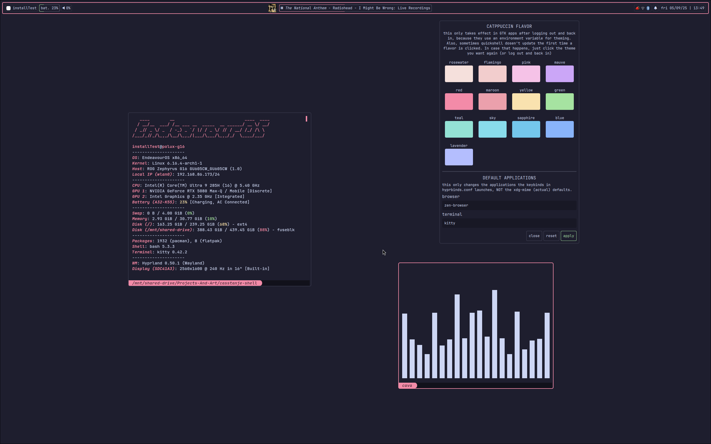
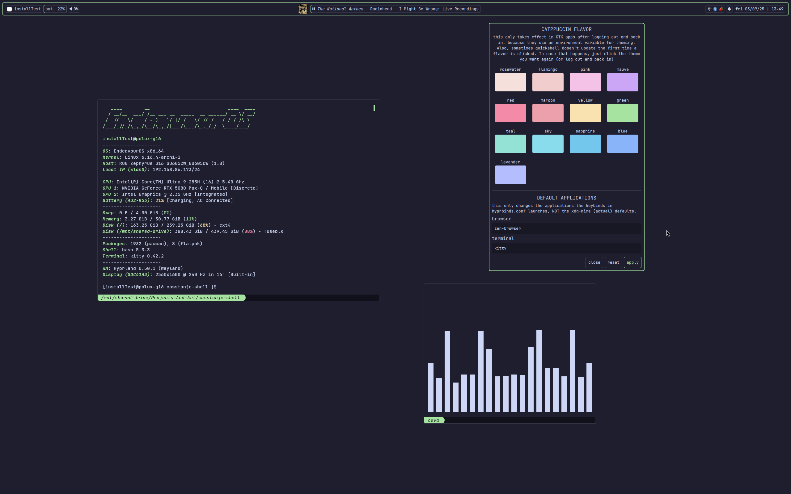
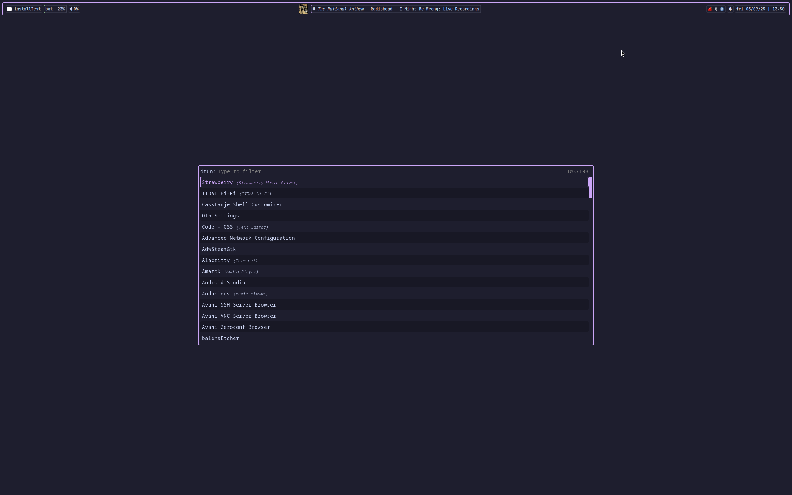

# Casstanje's Catppuccin Mocha Hyprland Shell for NixOS

## Gallery
 |  |
:-------------------------------------------------------: | :-----------------------------------------------------------:


---
A flat, simple rice for hyprland based on catppuccin mocha.

Now for NixOS!!


Most of the individual app configs and the qt / gtk themes are based on existing [catppuccin](https://catppuccin.com) ones.
Specifically:
- [GTK](https://github.com/catppuccin/gtk)
- [Kvantum](https://github.com/catppuccin/Kvantum) (QT)
- [Rofi](https://github.com/catppuccin/rofi)
- [Kitty](https://github.com/catppuccin/kitty)
## Features
### Customization GUI (Casstanje Shell Customizer)
A simple quickshell GUI that allows you to change the catppuccin accent and bar layout, as well as the apps you want the keybinds to open

### Custom bar written in quickshell
A customizable status bar with a start menu, battery indicator, volume control, media bar (panel??), system tray, notification server and a clock. All modules can be switched on and off, and some have specific settings that you can fiddle with.

### Hyprland keybind cheatsheet in rofi
SUPER + A, by default

Script from [here](https://github.com/jason9075/rofi-hyprland-keybinds-cheatsheet) (thanks)

## Installation

Requires flake and home-manager

> ### IMPORTANT
> To get all features to work properly, these settings must be set in your configuration.nix
> - ```networking.networkmanager.enable = true```
> - ```hardware.bluetooth.enable = true```
> - ```services.power-profiles-daemon.enable = true```
> - ```services.upower.enable = true```
> - ```services.pipewire.enable = true```
> - ```services.pipewire.pulse.enable = true```

Include repo in the inputs of your flake:
```nix
{
  inputs = {
    nixpkgs.url = "github:nixos/nixpkgs?ref=nixos-unstable";
    casstanje-shell.url = "git+:https://codeberg.org/casstanje/casstanje-shell";
  };
}
```

Then, include its home modules in your home-manager imports:
```nix
{
  nixosConfigurations.mypc = nixpkgs.lib.nixosSystem {
    modules = [
      ./configuration.nix
      home-manager.nixosModules.home-manager
      {
        home-manager.users.<username>.imports = [
          ./home.nix
          casstanje-shell.homeModules.default
        ];
        home-manager.extraSpecialArgs = { inherit inputs; };
      }
    ];
  };
}
```
> Note the line ```home-manager.extraSpecialArgs = { inherit inputs; };```. It is required.

Or if you have a standalone installation of home-manager:
```nix
  {
    homeConfigurations.<username> = home-manager.lib.homeManagerConfiguration {
      pkgs = nixpkgs.legacyPackages.x86_64-linux;
      modules = [
        ./home.nix
        casstanje-shell.homeModules.default
      ];
      home-manager.extraSpecialArgs = { inherit inputs; };
    };
  }
```

## TODO
### Bugs / Fixes
- Still notification image scaling issues T-T
### Features
- Stopwatch / Countdown timer in bar
- Notification sounds

## FAQ
### Why rofi?? Are you too lazy to make your own app launcher?????
Rofi has a bunch of extensions that I like to use (hyprland binds, emojis, clipboard history and more), plus it's customizable enough for this shell's needs. And yes, i'm lazy, but *shhhh*

### Bar config?
You can edit the bar using the Casstanje Shell Customizer GUI

### How do i change / add my profile image?
To change (or add) a profile image, create image in either the JPEG or PNG format that's under 400x400px, rename it to .face and place it in your home folder.